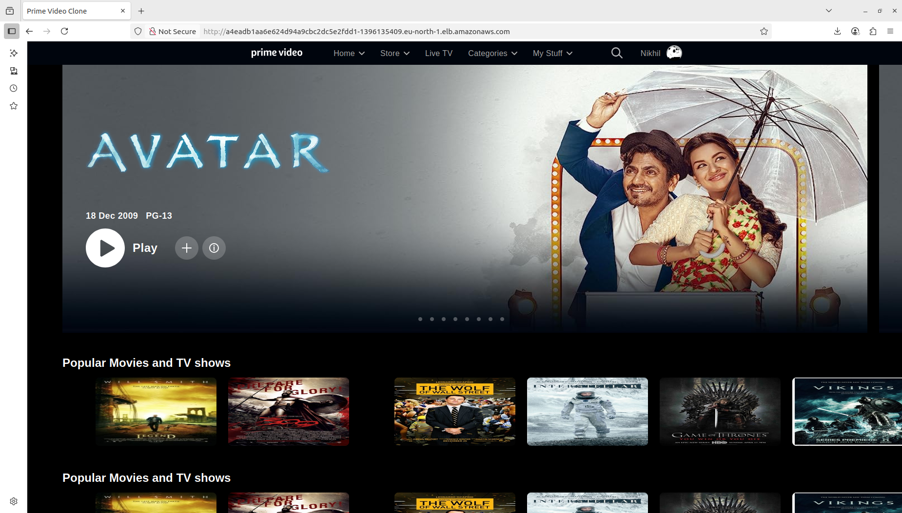

# **DevOps Project: Amazon-prime-video clone app Deployment on docker**

In this **DevOps project**, I demonstrate how to **deploy a Amazon-prime-video Clone App** using a variety of modern DevOps tools and services.

## **Phase 1: Initial setup and Deployment**

**Step 1: Launch EC2 (ubuntu 22.04)**

- Provision an EC2 instance on AWS with Ubuntu 22.04, t3x.large, storage= 30gb.
- Allow ports 
   - SSH 22
   - HTTP 80
   - HTTPS 443
   - TCP 8080
   - TCP 587
   - TCP 465
   - TCP 3000 
   - TCP 9000

- Set the **Source** to **anywhere**

- Connect the Instance using SSH.

**Step 2: Update the package**

```bash
sudo apt-get update
```

**step 3: Clone the Repository**

```bash
git clone https://github.com/didin8080/Amazon-prime.git
```


**step 4: Go inside the directory**

```bash
cd project-name
```
```bash
cd scripts
```
```bash
ll
```


**step 5: Add Executable Permission to shell scripts**

```bash
sudo chmod +x *.sh
```
(*) it provides all the shell scripts executable permission

**step 6: Install tools**

```bash
sh jenkins.sh

systemctl status jenkins
```
control+c to come out from this. 

```bash
sh docker.sh
```

Install sonarqube using docker

```bash
docker run -d --name sonar -p 9000:9000 sonarqube:lts-community

docker ps
docker images
```

```bash 
sh trivy.sh

trivy --version
```


**Step 7: Install necessary plugins on Jenkins**

Goto Jenkins dashboard--> Manage Jenkins --> Plugins

Install below plugins
- Eclipse temurim installer
- sonarqube scanner
- nodej
- OWASP dependency-check 5.5.1
- docker 1.6.2
- Docker commons
- docker pipeline
- docker api
- docker-build-step
- pipeline:stage view
- promethieus metrics
- email extension template
- Blueocean
- kubernetes
- Kubernetes Pipeline DevOps Steps
- Kubernetes credentials provider
- Kubernetes Client API Plugin

Restart when no jobs are running.


**Step 8: Tools configuration in jenkins**

Goto Jenkins dashboard--> Manage Jenkins --> tools 
- add jdk,give name as jdk17 ,install automatically ,add installer, install from adoptium.net, select jdk-17.0.8.1+1 
- add sonarqube scanner--> name= sonar-scaner,insall automatically,
- add node js--> name=node23 
- add docker --> name=docker,install automatically,add installer ,download from docker.com
- apply and save


**Step 9: ADD Credentials on Jenkins**

- On sonarqube -> admininstration-->security--> user--> rightside 3dots--> give any name --> generate token
- On jenkins --> manage jenkins-->credentials-->global--> add credentials--> kind=secret text --> on secret paste the token and give any name and description-->give any id and description-->create
- On jenkins --> manage jenkins-->credentials-->global--> add credentials-->kind=username with password--> username=give the username of dockerhub--> password=password of dockerhub-->create
- On jenkins --> manage jenkins-->credentials-->global--> add credentials--> kind=username with password--> username= provide your mail id -->password= the APP PASSWORD that you created --> id smtp.


**Step 10: System Configuration in Jenkins**

On jenkins--> manage jenkins--> system

- add sonarqube server -->give name as sonar-server--> on server url= paste the url of sonarqube -->select the authentication --> apply and save .
- Extended email notification --> On SMTP server= smtp.gmail.com --> SMTP port = 465 -->advanced --> enale use SSL --> on credentails = add credentials that we added for gmail
- E-mail Notification --> On SMTP server = smtp.gmail.com --> advanced --> enable use ssl --> smtp port 465--> enable use SMTP authentication --> username= your-email-id --> on password = app password `eg:(drsn anne afrd pcfx)`--> enable test configuration by sending email --> enter our email--> test configuration --> Goto your email you will get an test email from jenkins --> apply and save


**step 11: Create webhook in sonarqube**

- on jenkins--> manage jenkins--> system--> add sonarqube server -->give name as sonar-server--> on server url= paste the url of sonarqube with sonarqube-webhook eg:**(192.168.20.173:8080/sonarqube-webhook)** -->select the authentication --> apply and save .


**Step 12: Configure Project on Sonarqube**

On Sonarqube--> Create project -->give projet name and key name --> and create
--> select locally --> generate a token --> continue --> other --> Linux --> copy the command and paste it on the sonarqube analysis portion on jenkins pipeline


**Step 13: Configure CI/CD pipeline in jenkins**

 Before pasting the pipeline script, do the following changes in the script
1. In the stage 'Tag and Push to DockerHub', give your docker-hub username. Similar thing you should do in 'Deploy to kubernetes' stages
2. In post actions stage in pipeline, make sure to give the email id you have configured in jenkins.
3. Replace the checout repo and generate the link using Pipeline Syntax


```groovy
pipeline{
    agent any
    tools{
        jdk 'jdk17'
        nodejs 'node24'
    }
    environment {
        SCANNER_HOME=tool 'sonar-scanner'
    }
    stages {
        stage('clean workspace'){
            steps{
                cleanWs()
            }
        }
        stage('Checkout from Git'){
            steps{
                git branch: 'main', url: 'https://github.com/didin2003/amazon-prime-video-kubernetes.git'
            }
        }
        stage("Sonarqube Analysis "){
            steps{
                withSonarQubeEnv('sonar-server') {
                    sh ''' $SCANNER_HOME/bin/sonar-scanner -Dsonar.projectName=amazon-prime-video \
                    -Dsonar.projectKey=amazon-prime-video '''
                }
            }
        }
        stage("quality gate"){
           steps {
                script {
                    waitForQualityGate abortPipeline: false, credentialsId: 'sonar-token' 
                }
            } 
        }
        stage('Install Dependencies') {
            steps {
                sh "npm install"
            }
        }        
        stage('TRIVY FS SCAN') {
            steps {
                sh "trivy fs . > trivyfs.txt"
            }
        }
        stage("Docker Build & Push"){
            steps{
                script{
                   withDockerRegistry(credentialsId: 'docker', toolName: 'docker'){   
                       sh "docker build -t amazon-prime-video ."
                       sh "docker tag amazon-prime-video didin8080/amazon-prime-video:latest "
                       sh "docker push didin8080/amazon-prime-video:latest "
                    }
                }
            }
        }
		stage('Docker Scout Image') {
            steps {
                script{
                   withDockerRegistry(credentialsId: 'docker', toolName: 'docker'){
                       sh 'docker-scout quickview didin8080/amazon-prime-video:latest'
                       sh 'docker-scout cves didin8080/amazon-prime-video:latest'
                       sh 'docker-scout recommendations didin8080/amazon-prime-video:latest'
                   }
                }
            }
        }

        stage("TRIVY-docker-images"){
            steps{
                sh "trivy image didin8080/amazon-prime-video:latest > trivyimage.txt" 
            }
        }
        stage('App Deploy to Docker container'){
            steps{
                sh 'docker run -d --name amazon-prime-video -p 3000:3000 didin8080/amazon-prime-video:latest'
            }
        }

    }
    post {
    always {
        emailext attachLog: true,
            subject: "'${currentBuild.result}'",
            body: """
                <html>
                <body>
                    <div style="background-color: #FFA07A; padding: 10px; margin-bottom: 10px;">
                        <p style="color: white; font-weight: bold;">Project: ${env.JOB_NAME}</p>
                    </div>
                    <div style="background-color: #90EE90; padding: 10px; margin-bottom: 10px;">
                        <p style="color: white; font-weight: bold;">Build Number: ${env.BUILD_NUMBER}</p>
                    </div>
                    <div style="background-color: #87CEEB; padding: 10px; margin-bottom: 10px;">
                        <p style="color: white; font-weight: bold;">URL: ${env.BUILD_URL}</p>
                    </div>
                </body>
                </html>
            """,
            to: 'didinpg8080@gmail.com',
            mimeType: 'text/html',
            attachmentsPattern: 'trivy.txt'
        }
    }
}  
```

### Build it


Your application is deployed in docker to access it. 

`<public-ip:3000>`

<div align="center">

<p align="center"> Home Page </p>
</div>


**Application deployed in docker**


## **Phase 2: Moniter the Application**

**Step 1: Launch EC2 (Ubuntu 22.04)**

- Provision an EC2 instance on AWS Name: Monitoring Server, Ubuntu 24.04, t2.large, Select the SG created in the Step 1, EBS: 30GB.
- Connect to the instance using SSH.

We will install Grafana, Prometheus, Node Exporter in the above instance and then we will monitor

**Step 2: Update the packages**

```bash
sudo apt-get update
```


**Step 3: Installing Prometheus**

```bash
sudo useradd --system --no-create-home --shell /bin/false prometheus
wget https://github.com/prometheus/prometheus/releases/download/v2.47.1/prometheus-2.47.1.linux-amd64.tar.gz
#Extract Prometheus files, move them, and create directories:
tar -xvf prometheus-2.47.1.linux-amd64.tar.gz
cd prometheus-2.47.1.linux-amd64/
sudo mkdir -p /data /etc/prometheus
sudo mv prometheus promtool /usr/local/bin/
sudo mv consoles/ console_libraries/ /etc/prometheus/
sudo mv prometheus.yml /etc/prometheus/prometheus.yml
#Set ownership for directories:
sudo chown -R prometheus:prometheus /etc/prometheus/ /data/
```

**Create a systemd unit configuration file for Prometheus:**

```bash
sudo vi /etc/systemd/system/prometheus.service
```

**Add the following content to the prometheus.service file:**

```plaintext
[Unit]
Description=Prometheus
Wants=network-online.target
After=network-online.target

StartLimitIntervalSec=500
StartLimitBurst=5

[Service]
User=prometheus
Group=prometheus
Type=simple
Restart=on-failure
RestartSec=5s
ExecStart=/usr/local/bin/prometheus \
  --config.file=/etc/prometheus/prometheus.yml \
  --storage.tsdb.path=/data \
  --web.console.templates=/etc/prometheus/consoles \
  --web.console.libraries=/etc/prometheus/console_libraries \
  --web.listen-address=0.0.0.0:9090 \
  --web.enable-lifecycle

[Install]
WantedBy=multi-user.target
```

**Enable and start Prometheus:**

```bash
sudo systemctl enable prometheus
sudo systemctl start prometheus
```

**Verify Prometheus's status:**

```bash
sudo systemctl status prometheus
```

Press Control+c to come out


Access Prometheus in browser using your server's IP and port 9090:

`http://<your-server-ip>:9090`

Click on 'Status' dropdown ---> Click on 'Targets' ---> You can see 'Prometheus (1/1 up)'


**Step 4: Installing Node Exporter**

```bash
cd 
sudo useradd --system --no-create-home --shell /bin/false node_exporter
wget https://github.com/prometheus/node_exporter/releases/download/v1.6.1/node_exporter-1.6.1.linux-amd64.tar.gz
#Extract Node Exporter files, move the binary, and clean up:
tar -xvf node_exporter-1.6.1.linux-amd64.tar.gz
sudo mv node_exporter-1.6.1.linux-amd64/node_exporter /usr/local/bin/
rm -rf node_exporter*
```

**Create a systemd unit configuration file for Node Exporter:**

```bash
sudo vi /etc/systemd/system/prometheus.service
```

**Add the following content to the node_exporter.service file:**

```plaintext
[Unit]
Description=Node Exporter
Wants=network-online.target
After=network-online.target

StartLimitIntervalSec=500
StartLimitBurst=5

[Service]
User=node_exporter
Group=node_exporter
Type=simple
Restart=on-failure
RestartSec=5s
ExecStart=/usr/local/bin/node_exporter --collector.logind

[Install]
WantedBy=multi-user.target
```


**Enable and start Node Exporter:**

```bash
sudo systemctl enable node_exporter
sudo systemctl start node_exporter
```

**Verify Node Exporter status:**

```bash
sudo systemctl status node_exporter
```

Press Control+c to come out


**Step 5: Configure Prometheus Plugin Integration**

As of now we created Prometheus service, but we need to add a job in order to fetch the details by node exporter. So for that we need to create 2 jobs, one with 'node exporter' and the other with 'jenkins' as shown below;


Integrate Jenkins with Prometheus to monitor the CI/CD pipeline.

Prometheus Configuration:


**To configure Prometheus to scrape metrics from Node Exporter and Jenkins, you need to modify the prometheus.yml file.**

```bash
cd /etc/prometheus/
ls -l
#You can see the "prometheus.yml" file
sudo vi prometheus.yml
```

**You will see the content and also there is a default job called "Prometheus" Paste the below content at the end of the file;**


```yaml
- job_name: 'node_exporter'
    static_configs:
      - targets: ['<MonitoringVMip>:9100']

  - job_name: 'jenkins'
    metrics_path: '/prometheus'
    static_configs:
      - targets: ['<your-jenkins-ip>:<your-jenkins-port>']
```

In the above, replace <your-jenkins-ip> and <your-jenkins-port> with the appropriate IPs ----> esc ----> :wq


**Check the validity of the configuration file:**

```bash
promtool check config /etc/prometheus/prometheus.yml
```

You should see "SUCCESS" when you run the above command, it means every configuration made so far is good.

**Reload the Prometheus configuration without restarting:**

```bash
curl -X POST http://localhost:9090/-/reload
```

Access Prometheus in browser (if already opened, just reload the page):


`http://<your-prometheus-ip>:9090/targets`


Open Port number 9100 for Monitoring VM

You should now see "Jenkins (1/1 up)" "node exporter (1/1 up)" and "prometheus (1/1 up)" in the prometheus browser.


**step 6: Install Grafana**

You are currently in /etc/Prometheus path.


```bash
sudo apt-get update
sudo apt-get install -y apt-transport-https software-properties-common
cd
wget -q -O - https://packages.grafana.com/gpg.key | sudo apt-key add -
#You should see OK when executed the above command.
echo "deb https://packages.grafana.com/oss/deb stable main" | sudo tee -a /etc/apt/sources.list.d/grafana.list
sudo apt-get update
sudo apt-get -y install grafana
sudo systemctl enable grafana-server
sudo systemctl start grafana-server
sudo systemctl status grafana-server
```

Press control+c to come out


Access grafana in browser using your server's IP and port 3000:

`http://<your-server-ip>:3000`

Default username and password is "admin"

You can Set new password or you can click on "skip now".

Click on "skip now" (If you want you can create the password)


**Step 7: Add Prometheus Data Source:**

To visualize metrics, you need to add a data source. Follow these steps:

- Click on the gear icon (⚙️) in the left sidebar to open the "Configuration" menu.

- Select "Data Sources."

- Click on the "Add data source" button.

- Choose "Prometheus" as the data source type.

- In the "HTTP" section:
  - Set the "URL" to `http://localhost:9090` (assuming Prometheus is running on the same server).
  - Click the "Save & Test" button to ensure the data source is working.

**Step 8: Import a Dashboard:**
 
To make it easier to view metrics, you can import a pre-configured dashboard. Follow these steps:

- Click on the "+" (plus) icon in the left sidebar to open the "Create" menu.

- Select "Dashboard."

- Click on the "Import" dashboard option.

- Enter the dashboard code you want to import (e.g., code 1860).

- Click the "Load" button.

- Select the data source you added (Prometheus) from the dropdown.

- Click on the "Import" button.

You should now have a Grafana dashboard set up to visualize metrics from Prometheus.

Grafana is a powerful tool for creating visualizations and dashboards, and you can further customize it to suit your specific monitoring needs.

That's it! You've successfully installed and set up Grafana to work with Prometheus for monitoring and visualization 


## **Phase 3: Kubernetes**


### Deploy Application on Argocd Kubernetes

**Step 1: create kubectl on local system**

```bash
curl -o kubectl https://amazon-eks.s3.us-west-2.amazonaws.com/1.19.6/2021-01-05/bin/linux/amd64/kubectl
chmod +x ./kubectl
sudo mv ./kubectl /usr/local/bin
kubectl version --short --client
```

**Step 2: create awscli on local system**

```bash
sudo apt install unzip
curl "https://awscli.amazonaws.com/awscli-exe-linux-x86_64.zip" -o "awscliv2.zip"
unzip awscliv2.zip
sudo ./aws/install
aws --version
```

**Step 3: create eksctl on local system**

```bash
curl --silent --location "https://github.com/weaveworks/eksctl/releases/latest/download/eksctl_$(uname -s)_amd64.tar.gz" | tar xz -C /tmp
sudo mv /tmp/eksctl /usr/local/bin
eksctl version
```


**Step 4: Aws Configure** 

```bash
aws configure
```

Provide Aws Access id, Password, Region, Format=Json


**Step 5: create Kubernetes Cluster**


```bash
eksctl create cluster --name=amazon-cluster --region eu-north-1 --zones eu-north-1b,eu-north-1c --without-nodegroup
```


It will take atleast 20-25 minutes for the cluster to create.


**Step 6: Create & Associate IAM OIDC Provider for our EKS Cluster**


```bash
eksctl utils associate-iam-oidc-provider --region eu-north-1 --cluster amazon-cluster --approve
```


**Step 7: Create node group**


```bash
eksctl create nodegroup --cluster amazon-cluster --region eu-north-1 --name node2 --node-type t3.medium --nodes 2 --nodes-min 2 --nodes-max 4 --node-volume-size 20 --ssh-access --ssh-public-key sonu --managed --asg-access --external-dns-access --full-ecr-access --appmesh-access --alb-ingress-access
```


**Step 8: Configure CI/CD pipeline in jenkins**

 Before pasting the pipeline script, do the following changes in the script
1. In the stage 'Tag and Push to DockerHub', give your docker-hub username. Similar thing you should do in 'Deploy to kubernetes' stages
2. In post actions stage in pipeline, make sure to give the email id you have configured in jenkins.
3. Replace the checout repo and generate the link using Pipeline Syntax


```groovy
pipeline{
    agent any     
    stages {
        stage('clean workspace'){
            steps{
                cleanWs()
            }
        }
        stage('Checkout from Git'){
            steps{
                git branch: 'main', url: 'https://github.com/didin2003/amazon-prime-video-kubernetes.git'
            }
        }        
        stage('Deploy to EKS Cluster') {
            steps {
                dir('kubernetes') {
                script {
                    sh '''
                    echo "Verifying AWS credentials..."
                    aws sts get-caller-identity

                    echo "Configuring kubectl for EKS cluster..."
                    aws eks update-kubeconfig --region eu-north-1 --name amazon-cluster

                    echo "Verifying kubeconfig..."
                    kubectl config view

                    echo "Deploying application to EKS..."
                    kubectl apply -f manifest.yml
                    
                    echo "Verifying deployment..."
                    kubectl get pods
                    kubectl get svc
                    '''
                }
            }
         }
       }
    }
    post {
    always {
        emailext attachLog: true,
            subject: "'${currentBuild.result}'",
            body: """
                <html>
                <body>
                    <div style="background-color: #FFA07A; padding: 10px; margin-bottom: 10px;">
                        <p style="color: white; font-weight: bold;">Project: ${env.JOB_NAME}</p>
                    </div>
                    <div style="background-color: #90EE90; padding: 10px; margin-bottom: 10px;">
                        <p style="color: white; font-weight: bold;">Build Number: ${env.BUILD_NUMBER}</p>
                    </div>
                    <div style="background-color: #87CEEB; padding: 10px; margin-bottom: 10px;">
                        <p style="color: white; font-weight: bold;">URL: ${env.BUILD_URL}</p>
                    </div>
                </body>
                </html>
            """,
            to: 'didinpg8080@gmail.com',
            mimeType: 'text/html',
            attachmentsPattern: 'trivy.txt'
        }
    }
} 
```


And the end of the console out you will get a external ip like this `http://a4eadb1aa6e624d94a9cbc2dc5e2fdd1-1396135409.eu-north-1.elb.amazonaws.com/`
If you wont get type

```bash
kubectl get all
```

<div align="center">

<p align="center"> Home Page </p>
</div>

